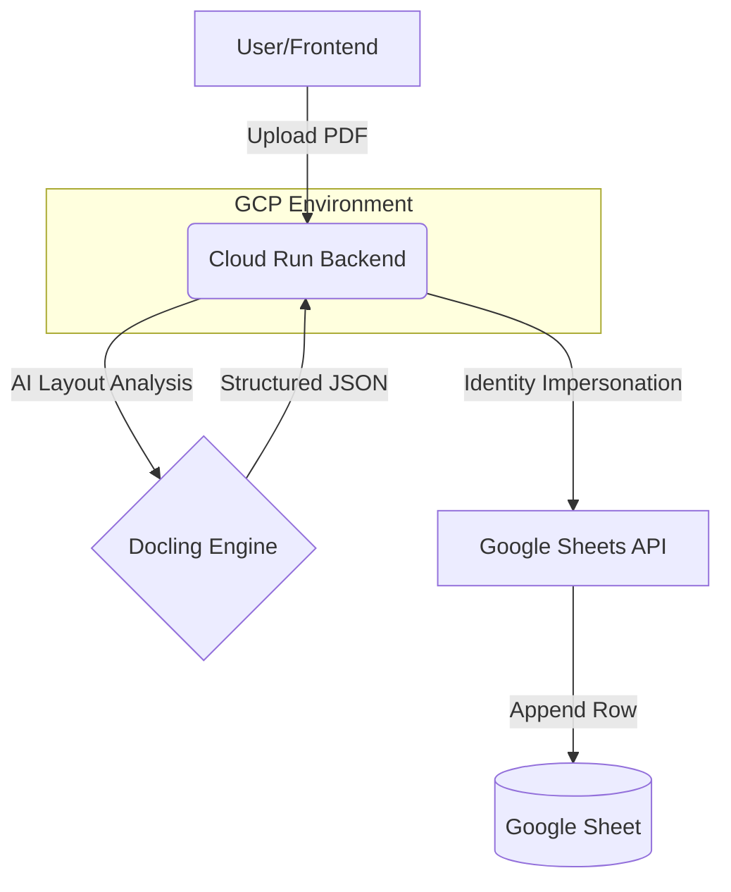

# 📑 Bill Genius: AI-Powered Invoice Extraction

[](./deployment_guide.md)
[](./LICENSE)

**Bill Genius** is a production-grade pipeline designed to automate the messy process of invoice data entry. Using industry-leading AI layouts and secure service account impersonation, it transforms raw PDFs into structured data in Google Sheets with zero friction.

---

## 🏗️ Architecture

The system is designed for high reliability and security, using **Keyless Authentication** on Google Cloud.



### Tech Stack
- **Frontend**: [Next.js 16](https://nextjs.org/) (Static Export) + Tailwind CSS 4 + Framer Motion.
- **Backend**: [FastAPI](https://fastapi.tiangolo.com/) + [Docling](https://github.com/DS4SD/docling) (Layout-aware OCR/Parsing).
- **Security**: Service Account Impersonation (No long-lived JSON keys in containers).
- **Deployment**: Google Cloud Run & Firebase Hosting.

---

## ✨ Key Features

- **🎯 Precision Extraction**: Layout-aware parsing identifies tables, totals, and line items even in complex documents.
- **🛡️ Enterprise Security**: Uses per-request impersonation tokens instead of static service account keys.
- **☁️ Serverless Scaling**: Backend scales to zero on Cloud Run; Frontend is served globally via Firebase CDN.
- **📊 Real-time Sync**: Direct integration with Google Sheets for immediate data visibility.

---

## 🚀 Quick Start (Local Development)

### 1. Prerequisites
- Python 3.12+ (managed via `uv` recommended)
- Node.js 20+
- A Google Cloud Project with Sheets API enabled.

### 2. Backend Setup
```bash
cd backend-extraction
uv pip install -r requirements.txt
cp .env.example .env
# Configure your GOOGLE_SHEET_ID and IMPERSONATED_SERVICE_ACCOUNT
python main.py
```

### 3. Frontend Setup
```bash
cd frontend
npm install
npm run dev
```
Navigate to `http://localhost:3000`.

---

## 🛠️ Configuration

| Variable | Description | Location |
| :--- | :--- | :--- |
| `GOOGLE_SHEET_ID` | The ID of the target Google Sheet | `.env` |
| `IMPERSONATED_SERVICE_ACCOUNT` | The email of the service account to impersonate | `.env` |
| `NEXT_PUBLIC_BACKEND_URL` | The URL of the FastAPI service | `frontend/.env.local` |

---

## 📦 Deployment

For production deployment instructions, IAM setup, and CI/CD best practices, refer to the [**Deployment Guide**](./deployment_guide.md).

---

© 2026 Harsh Thumar & Prince. Built for efficiency.

